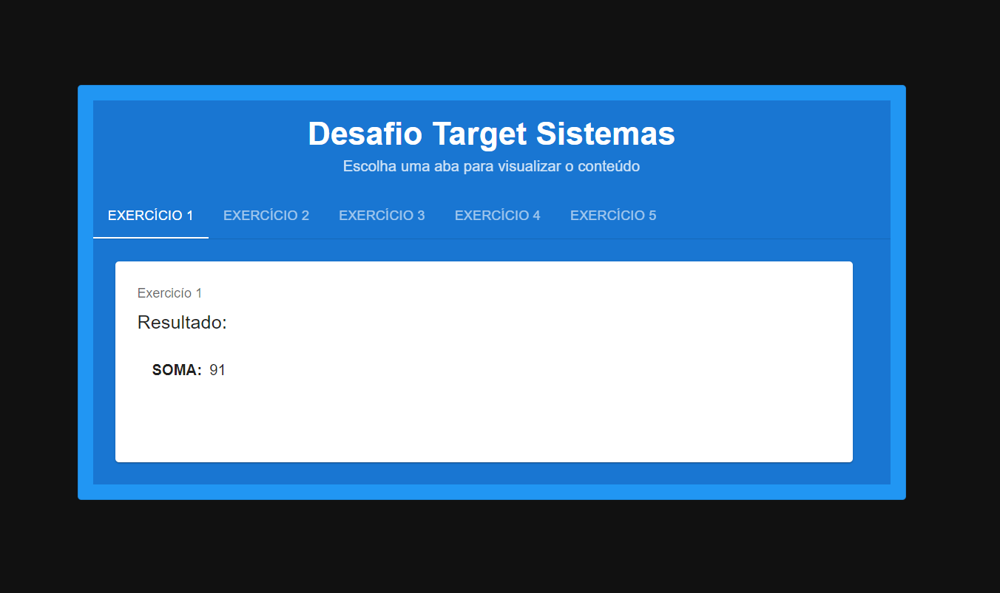
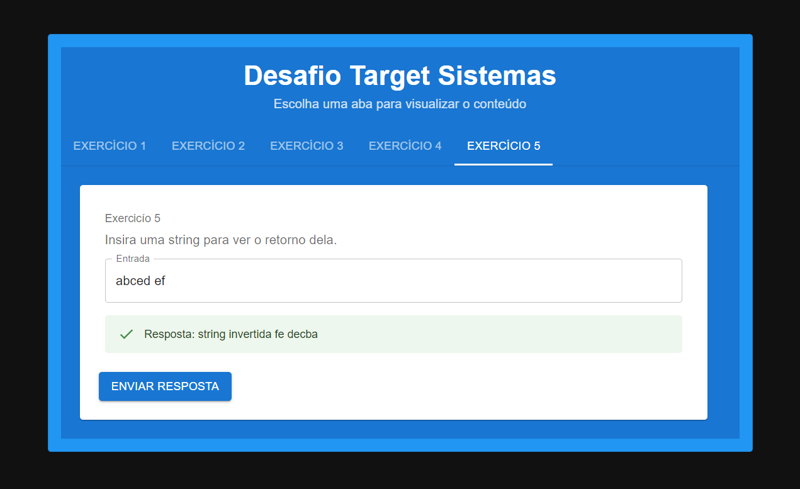

# desafio-tecnico-target-sistemas

## Tecnologias Usadas

- **Frontend**:

  - React
  - Javascript
  - Material UI
  - Axios para chamadas API

- **Backend**:
  - Node.js
  - Javascript
  - Express

- **Container**
  - Docker
  - Docker Compose


## Imagens da Aplicação

|  |  |
| ----------------------------------- | --------------------------------------- |
| Exercício 1                       | Exercício 2                      |


## Instalação

### Pré-requisitos

- Node.js (v18 ou superior)
- NPM ou Yarn

### Passos para Executar o Projeto

Existem duas maneiras de rodar o projeto: utilizando um gerenciador de pacotes ou através de um container com Docker.

#### 1. Via Docker

Para iniciar o projeto com Docker, execute o seguinte comando:

```bash
docker compose up --build
```

#### 2. Via Gerenciador de Pacotes

1. **Clone o repositório:**

```bash
git clone https://github.com/artur-seppa/desafio-tecnico-target-sistemas.git
```

2. **Instale as dependências do Backend:**

```bash
cd Backend
npm install
```

3. **Instale as dependências do Frontend:**

```bash
cd ..
cd frontend
npm install
```

4. **Rodando o Backend e Frontend:**

- Inicie o backend:

```bash
cd Backend
npm run dev
```

- Inicie o frontend:

```bash
cd frontend
npm start
```